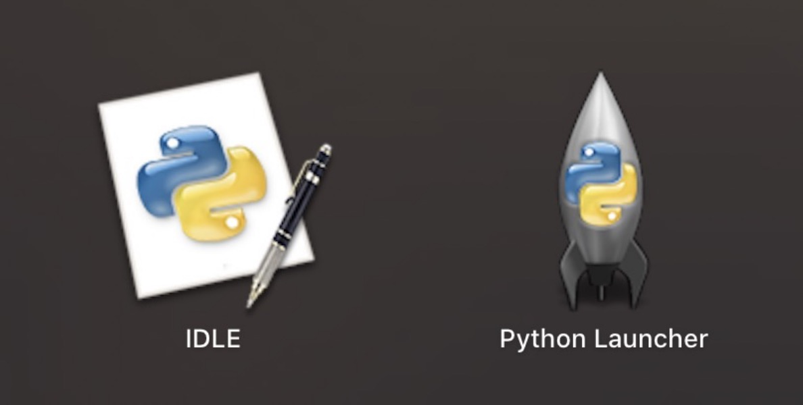

# 开发手册

### 环境

##### 1）系统

Windows/Ubuntu：Android平台相关功能

Mac：iOS平台相关功能

##### 2）python

下载Python 2.7.18（3.x版本未经完整测试），下载链接：

>   官方下载：https://www.python.org/downloads/release/python-2718/


安装完成后确认

```shell
$ python --version
Python 2.7.18
```

MacOS平台安装完成后，在启动面板出现如下两个图标



##### 3）java

JDK版本：1.8.0

```shell
$ java -version
java version "1.8.0_121"
Java(TM) SE Runtime Environment (build 1.8.0_121-b13)
Java HotSpot(TM) 64-Bit Server VM (build 25.121-b13, mixed mode)
```

##### 4）安装

若无则忽略此步骤

```shell
# 一键安装
$ sudo python setup/setup.py install

# 若安装失败，则需要在setup目录解压对应的插件手动安装，如：
$ sudo python setup/xxx/setup.py install
```

### 异常问题

##### 1）Windows平台java加密库依赖

异常错误：

```java
java.security.InvalidKeyException: Illegal key size or default parameters
```

Java7环境，解压：setup/policy_for_java7.zip

Java8环境，解压：setup/policy_for_java8.zip

把里面的两个jar包：local_policy.jar  和 US_export_policy.jar  替换掉原来  Jdk  安装目录 $\Java\jre{6|7|8}\lib\security 下的两个jar 包接可以了。

比如我的Java JDK 替换全目录为：C:\Java\jdk1.8.0_66\jre\lib\security 那就把2个Jar Copy覆盖到当前目录即可。

