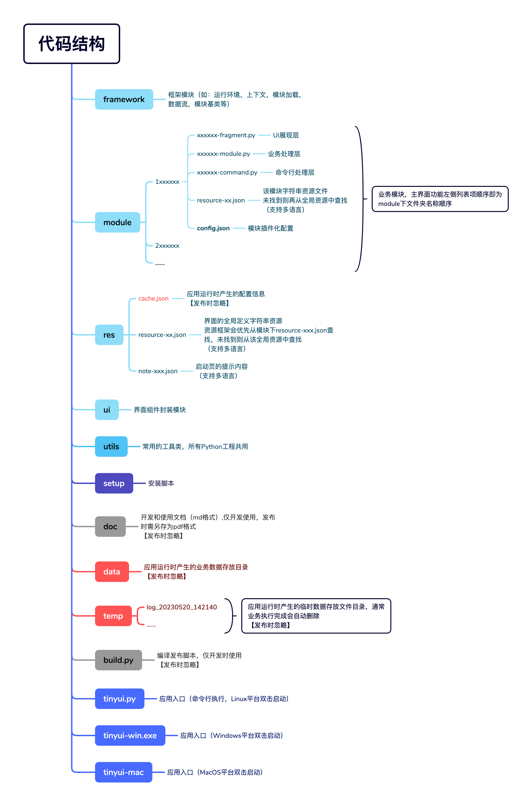

## 开发手册

### 工程说明



### 快速开发

##### 创建

1.  如我们要开发的应用名称为`demo`，则将代码中的`tinyui`全部替换成`demo`。

2.  创建子模块（如子模块的名称为`abc`），需要同时创建三个文件，并且配置`config.json`：
    ```json
    {
      "command": "abc_command.py",
      "fragment": "abc_fragment.py",
      "module": "abc_module.py"
    }
    ```

3.  为了保证多个模块显示的顺序，需在模块文件夹命名时增加数字。

##### 资源

1.  全局资源在`res`目录下，可以新增或者修改。
2.  通常模块的资源存放在模块文件夹目录下。

### 编译发布

在命令行执行`build.py`，即可选择要发布的模块。

```shell
$ python build.py
    1: 1samplebasic
    2: 2samplelist
    3: 3sampletree
    4: 4sampledialog
  choose all: <Enter Key>
  >>>: 1 4
```

每次编译会自动将版本的`build`号递增。

```shell
Version: 1.0.0.2 -> 1.0.0.3
```


