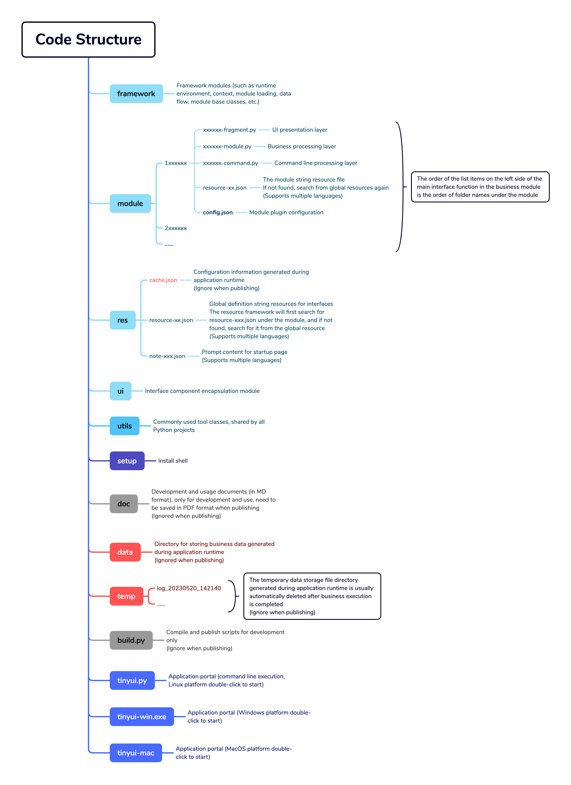

## User Guide

### Description



### Develop

##### Create

1.  If the application name we are developing is `demo`, replace all `tinyui` in the code with `demo`.

2.  To create a submodule (such as a submodule named `abc`), you need to create three files at the same time and configure `config. json`:
    ```json
    {
      "command": "abc_command.py",
      "fragment": "abc_fragment.py",
      "module": "abc_module.py"
    }
    ```

3.  To ensure the order in which multiple modules are displayed, it is necessary to add numbers when naming module folders.

##### Resource

1.  Global resources can be added or modified in the `res` directory.
2.  Typically, the resources of a module are stored in the module folder directory.

### Build & Publish

Execute `build. py` on the command line to select the module to publish.

```shell
$ python build.py
    1: 1samplebasic
    2: 2samplelist
    3: 3sampletree
    4: 4sampledialog
  choose all: <Enter Key>
  >>>: 1 4
```

Each compilation will automatically increment the version's `build` number.

```shell
Version: 1.0.0.2 -> 1.0.0.3
```


