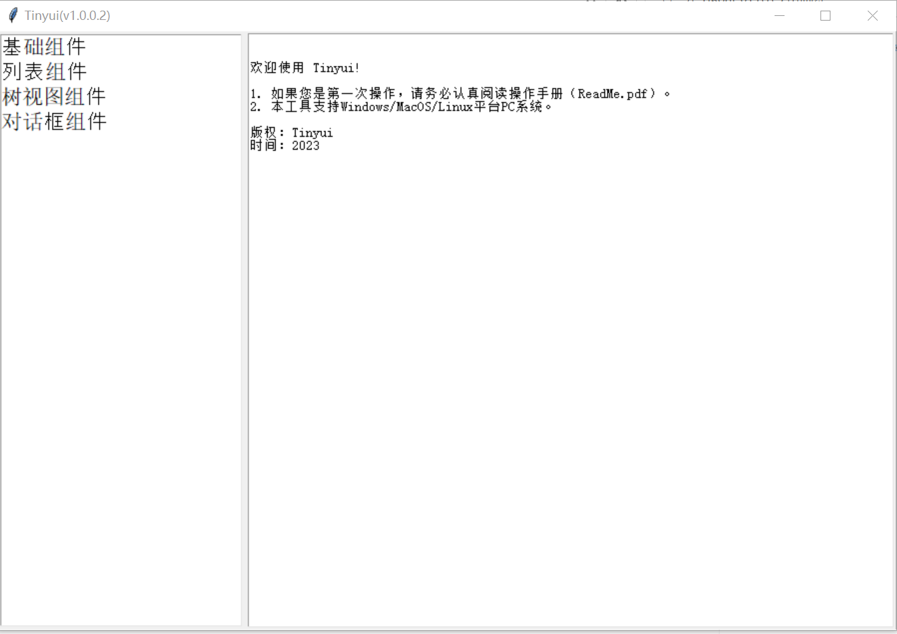
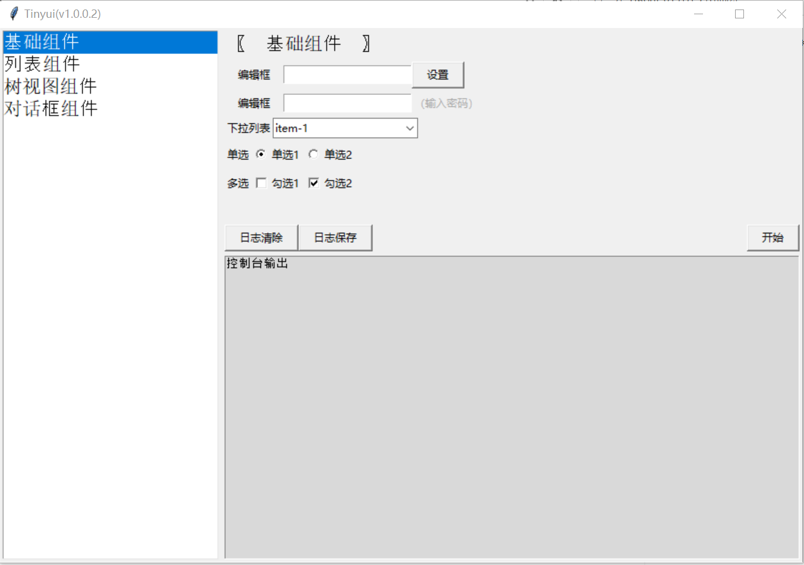
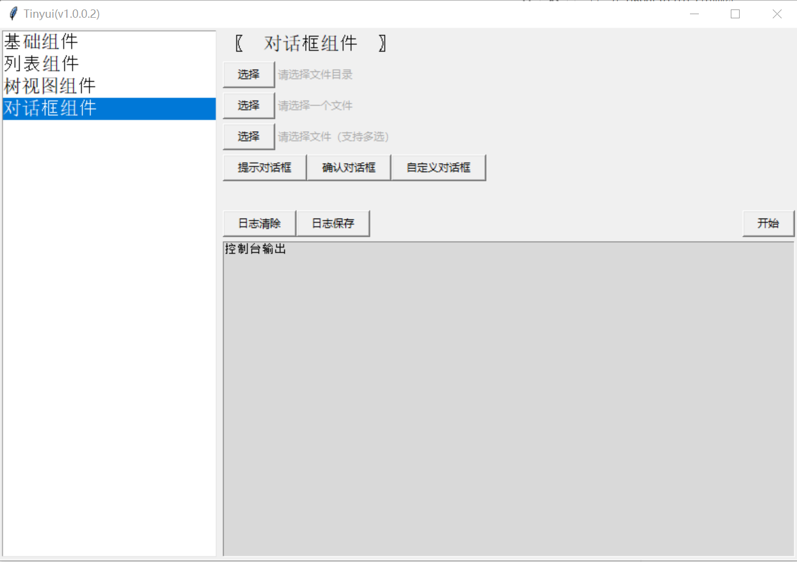
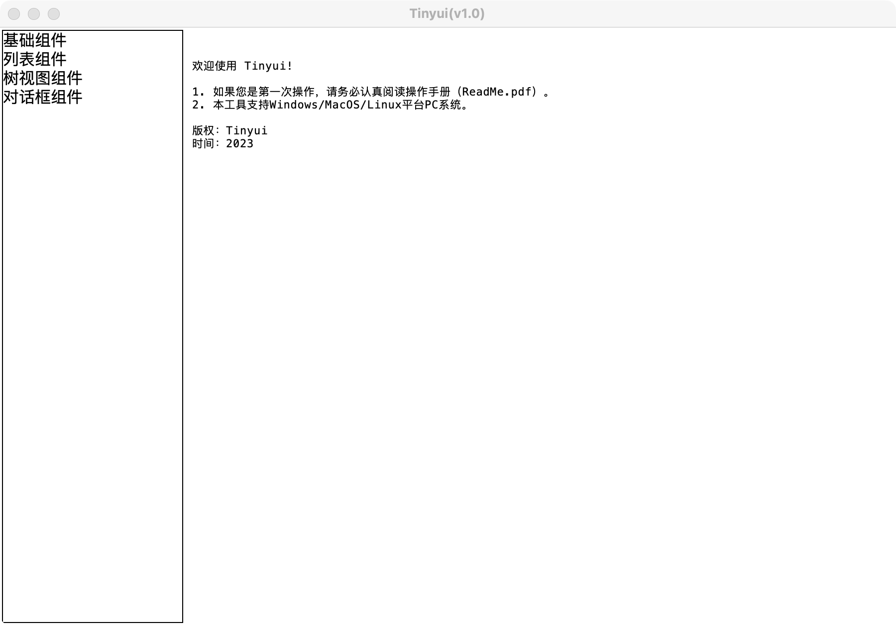
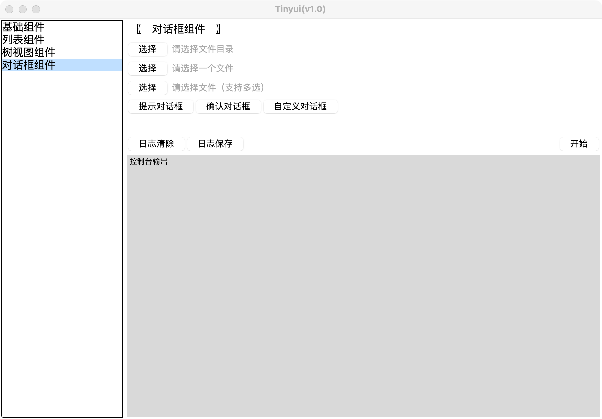
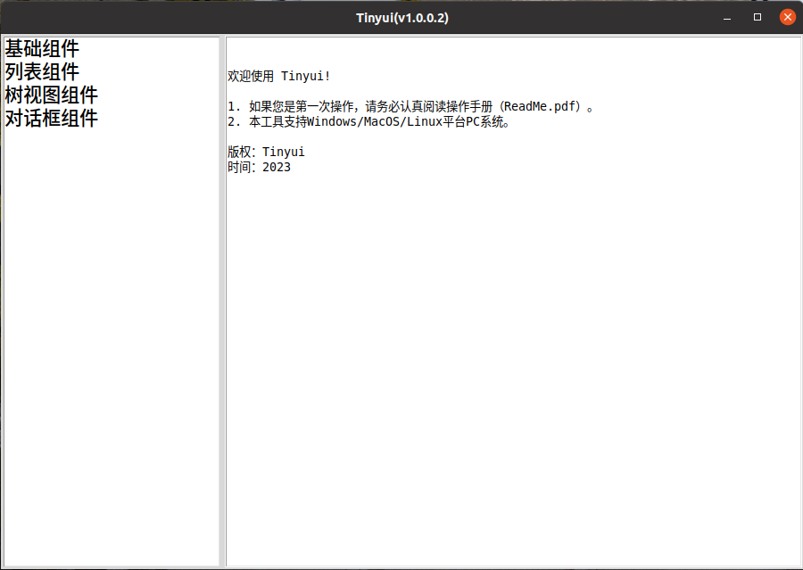
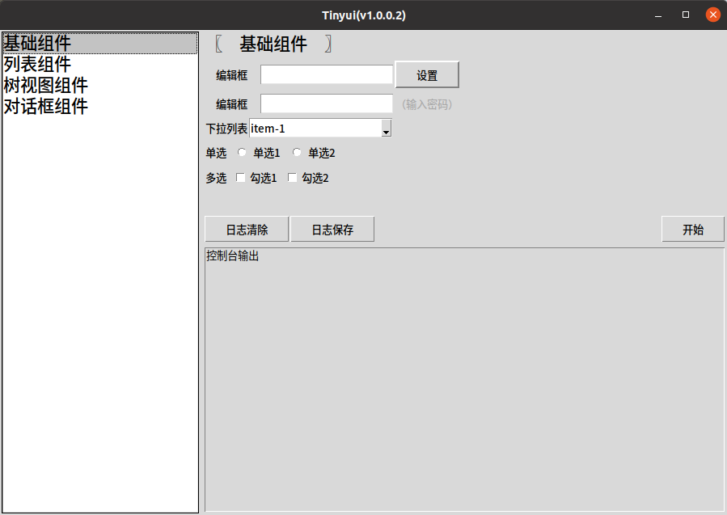
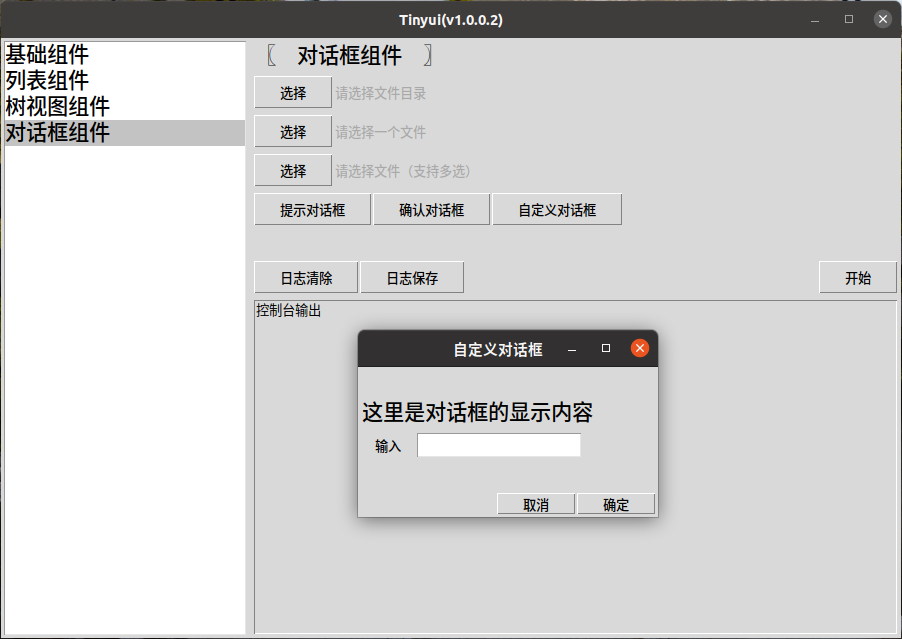

### 导航

-   [开发指南](develop-guide-cn.md)
-   [用户手册](user-guide-cn.md)

### 说明

在产品或项目工作中，可能会遇到需要给非开发人员或者客户提供简易的`PC`小工具，这些小工具通常用户交互比较简单；功能也不复杂；同时需要支持多平台以便适用更多场景。

由于`Python`开发简单，跨平台，且自带简易的`gui`框架库，因此本项目基于`tkinter`简单封装了跨平台的客户端，方便有此需求的开发者可以快速构建一个跨平台的应用。

-   支持`Windows/MacOS/Linux`
-   支持欢迎页说明
-   支持多语言（中文/英文）
-   支持界面输入内容记忆功能
-   支持子功能按需发布（插件化加载）
-   支持一键编译发布（打包）
-   支持执行过程控制台输出和日志记录

### 功能

##### Windows

**运行方式：**

-   方式1：在文件管理器或桌面双击`tinyui-win.exe`
-   方式2：在`cmd`终端中输入命令`python tinyui.py`

**应用界面：**

##### MacOS

**运行方式：**

-   方式1：在`Finder/访达`或桌面双击`tinyui-mac`
-   方式2：在终端中输入命令`python tinyui.py`

**应用界面：**

##### Linux（Ubuntu）

**运行方式：**

-   方式1：在文件管理器或桌面双击`tinyui-linux.sh`
-   方式2：在终端中输入命令`python tinyui.py`

**应用界面：**

### 许可协议

本项目基于`MIT`许可协议，详情查看 [许可协议](LICENSE) 文档。

>本项目和所有的`tinyui`工具都是MIT许可证下的开源工具，这意味着你可以完全访问源代码，并可以根据自己的需求进行修改。

