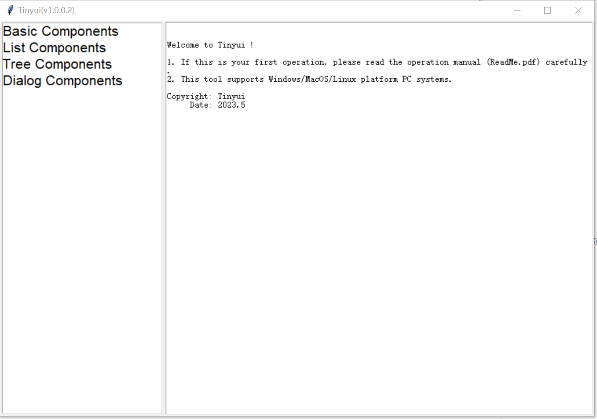
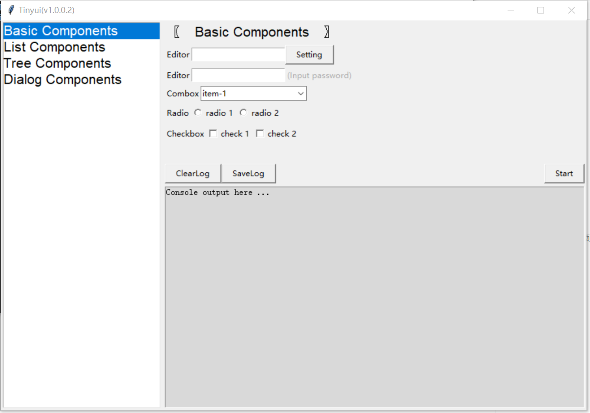
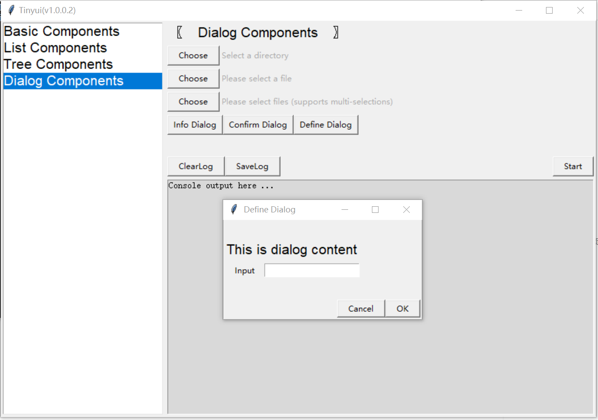
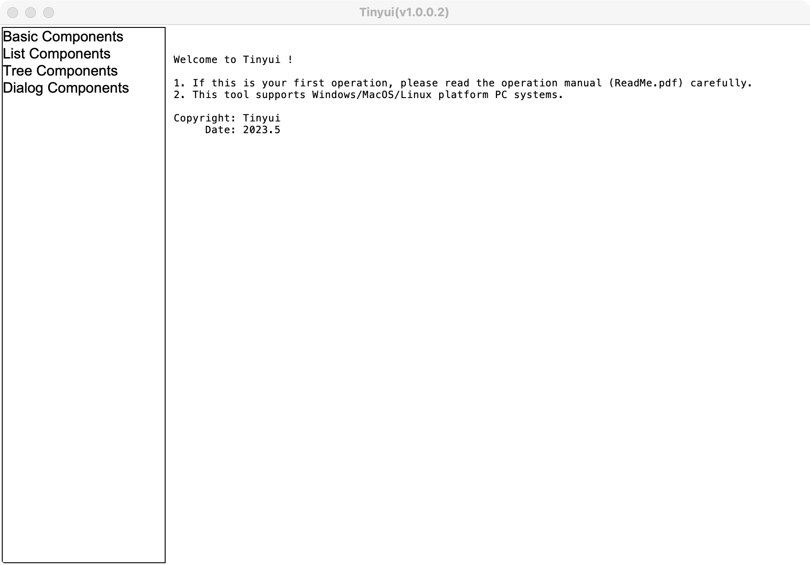
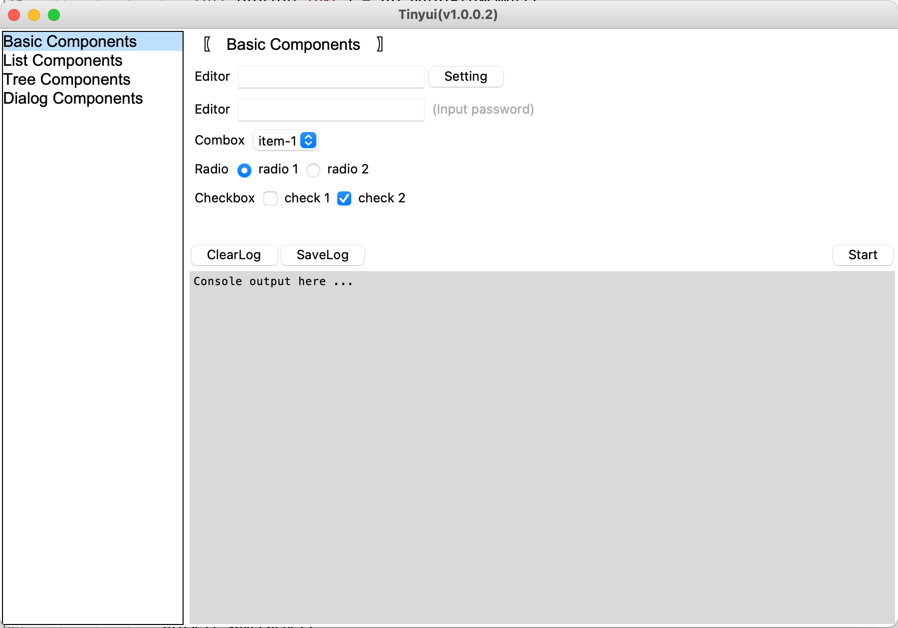
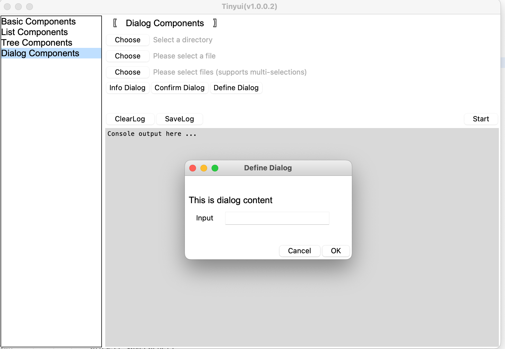
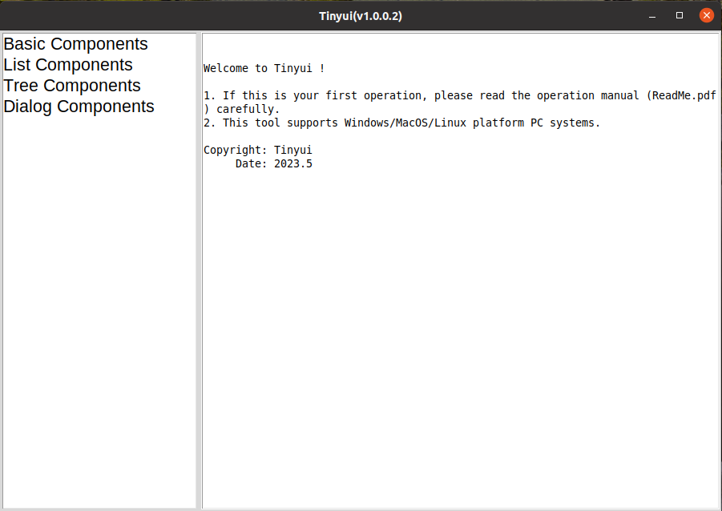
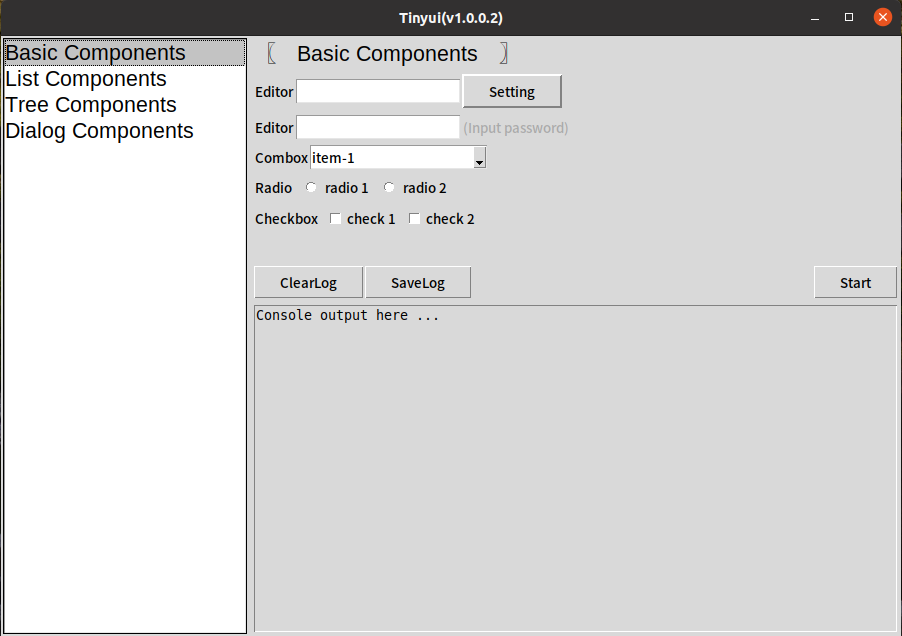
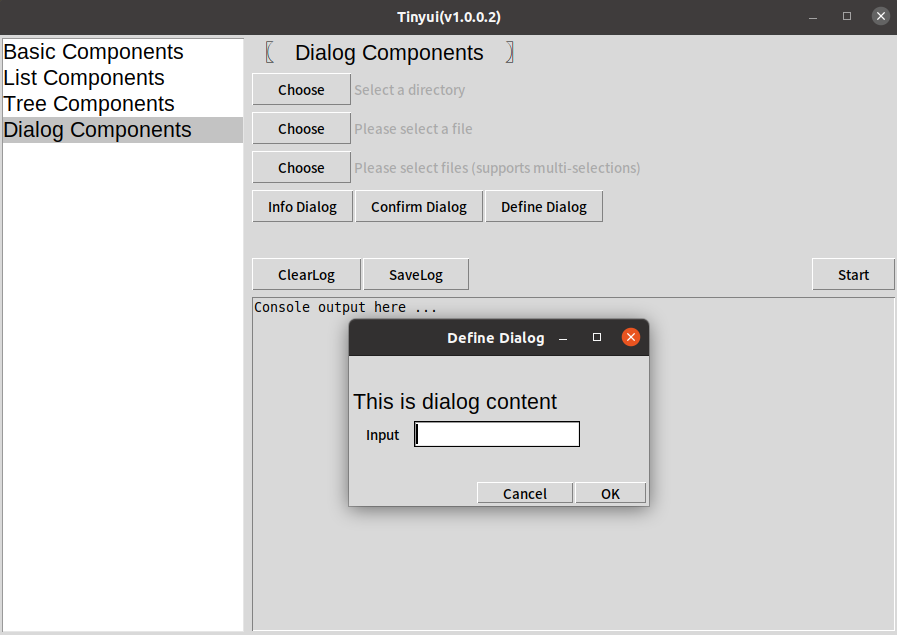

### Navigation

-   [Develop Guide](develop-guide-en.md)
-   [User Guide](user-guide-en.md)

### Description

In product or project work, you may encounter the need to provide simple `PC` widgets for non developers or customers, which usually have relatively simple user interaction; The function is not complex; At the same time, it is necessary to support multiple platforms in order to adapt to more scenarios.

Due to the simplicity and cross platform development of `Python`,  as well as the built-in simple `gui` framework library, this project is based on `tkinter` of a cross platform client for developers with this need to quickly build a cross platform application.

-   Support for `Windows/MacOS/Linux`
-   Support Welcome Page Description
-   Support for multiple languages (Chinese/English)
-   Support interface input content memory function
-   Support for on-demand publishing of subfunctions (plugin loading)
-   Supports one click compilation and publishing (packaging)
-   Support console output and logging during execution

### Function

##### Windows

**Operation mode :** 

-   Method 1:  Double click on `tinyui-win.exe` in the file manager or desktop
-   Method 2:  Enter the command `python tinyui.py` in the `cmd` terminal

**Application interface :**

##### MacOS

**Operation mode :** 

-   Method 1:  Double click on `tinyui-mac` in the `Finder` or desktop
-   Method 2:  Enter the command `python tinyui.py` in the terminal

**Application interface :**

##### Linux（Ubuntu）

**Operation mode :** 

-   Method 1:  Double click on `tinyui.py` in the file manager or desktop
-   Method 2:  Enter the command `python tinyui.py` in the terminal

**Application interface :**

### LICENSE

This project is licensed under the terms of the `MIT` license. See the [LICENSE](LICENSE) file.

>   This project and all `tinyui` tools are open source under the MIT license, which means you have full access to the source code and can modify it to fit your own needs. 

