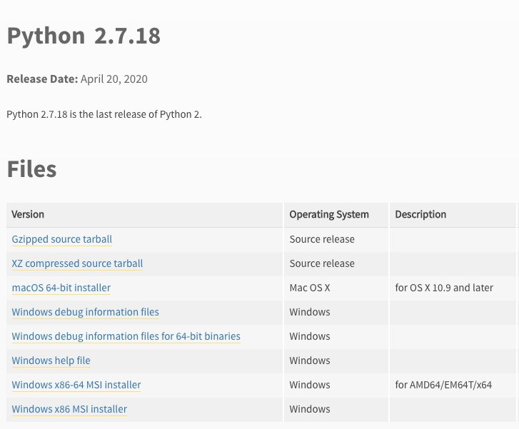

## 操作指南

### 环境（已配置则忽略）

##### 1）系统

支持：`Windows`、`MacOS`、`Linux(Ubuntu)`平台运行。

##### 2）Python

安装 `Python` 运行环境（已安装则忽略）。

2.1）`2.x`版本推荐使用最后一个稳定版 `2.7.18`，下载链接：

>   官方下载：https://www.python.org/downloads/release/python-2718/



安装完成后确认

```shell
$ python --version
Python 2.7.18
```

2.2）`3.x`版本推荐使用最新版本，下载链接：

>官方下载：https://www.python.org/downloads/

2.3）`MacOS`平台安装完成后，在启动面板出现如下两个图标


##### 3）java

若程序中需要运行`jar`，则需要安装`JDK`，推荐版本：`1.8.0`（`Java 8`）

```shell
$ java -version
java version "1.8.0_121"
Java(TM) SE Runtime Environment (build 1.8.0_121-b13)
Java HotSpot(TM) 64-Bit Server VM (build 25.121-b13, mixed mode)
```

##### 4）安装

若无则忽略此步骤

```shell
# 一键安装
$ sudo python setup/setup.py install

# 若安装失败，则需要在setup目录解压对应的插件手动安装，如：
$ sudo python setup/xxx/setup.py install
```

### 运行

##### Windows

-   方式1：在文件管理器或桌面双击`tinyui-win.exe`
-   方式2：在`cmd`终端中输入命令`python tinyui.py`

##### MacOS

-   方式1：在`Finder/访达`或桌面双击`tinyui-mac`
-   方式2：在终端中输入命令`python tinyui.py`

##### Linux（Ubuntu）

正常情况下Python的安装版本会自带`tk`库，可以在终端使用如下命令确认，运行成功则会弹出一个简单的小窗口。

```shell
# Python 2
$ python -m Tkinter

# Python 3
$ python3 -m tkinter
```

若未安装，则需要执行如下命令进行安装：

```shell
# Python 2
$ sudo apt-get install python-tk

# Python 3
$ sudo apt-get install python2-tk
```

环境配置完成后，即可运行：

-   方式1：在文件管理器或桌面双击`tinyui.py`，需要确认文件管理器的点击配置，如：
    
    
-   方式2：在终端中输入命令`python tinyui.py`

