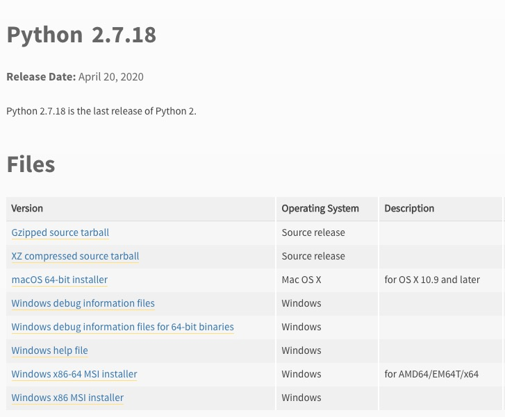
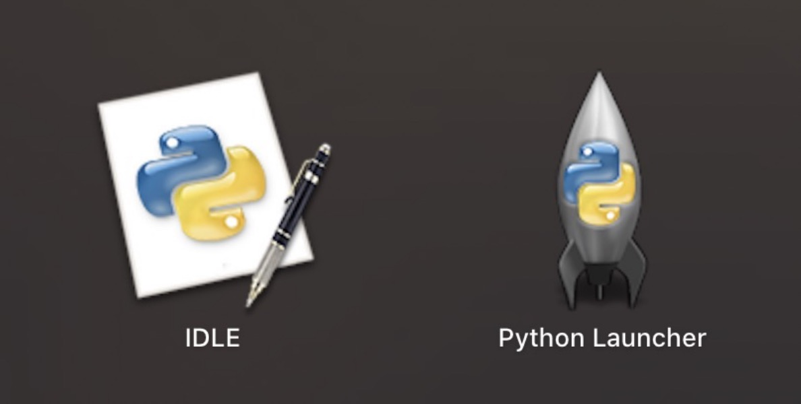
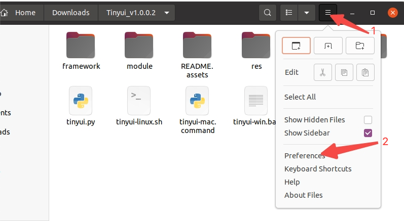
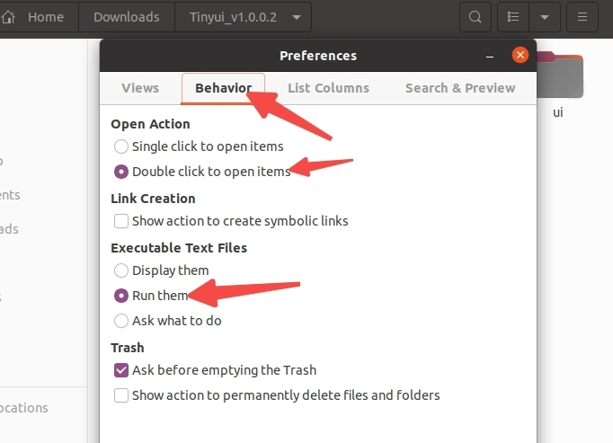

## User Guide

### Environment (ignored if configured)

##### 1）OS

Support `Windows`、`MacOS`、`Linux(Ubuntu)` platform

##### 2）Python

Install the `Python` runtime environment (ignored if installed).

2.1）It is recommended to use the last stable version of `2.7.18` for version `2. x`. Download link:

>   Download: https://www.python.org/downloads/release/python-2718/



Confirm after installation

```shell
$ python --version
Python 2.7.18
```

2.2） The latest version is recommended for version `3.x`, download link:

>Download: https://www.python.org/downloads/

2.3）After the installation of the MacOS platform is completed, the following two icons appear on the startup panel



##### 3）java

If you need to run `jar` in the program, you need to install `JDK`. The recommended version is: `1.8.0`（`Java 8`）

```shell
$ java -version
java version "1.8.0_121"
Java(TM) SE Runtime Environment (build 1.8.0_121-b13)
Java HotSpot(TM) 64-Bit Server VM (build 25.121-b13, mixed mode)
```

##### 4）Install

If none, ignore this step

```shell
# quick installation
$ sudo python setup/setup.py install

# If the installation fails, you need to unzip the corresponding plugin in the setup directory and manually install it, such as:
$ sudo python setup/xxx/setup.py install
```

### 运行

##### Windows

-   Method 1:  Double click on `tinyui-win.exe` in the file manager or desktop
-   Method 2:  Enter the command `python tinyui.py` in the `cmd` terminal

##### MacOS

-   Method 1:  Double click on `tinyui-mac` in the `Finder` or desktop
-   Method 2:  Enter the command `python tinyui.py` in the terminal

##### Linux（Ubuntu）

Under normal circumstances, the installation version of Python will come with its own `tk` library, which can be confirmed by using the following command on the terminal. If successful, a simple small window will pop up.

```shell
# Python 2
$ python -m Tkinter

# Python 3
$ python3 -m tkinter
```

If not installed, you need to execute the following command to install:

```shell
# Python 2
$ sudo apt-get install python-tk

# Python 3
$ sudo apt-get install python2-tk
```

After the environment configuration is completed, you can run:

-   Method 1: Double click on 'tinyui. py' in the file manager or desktop to confirm the click configuration of the file manager, such as:
    
    
-   Method 2:  Enter the command `python tinyui.py` in the terminal

