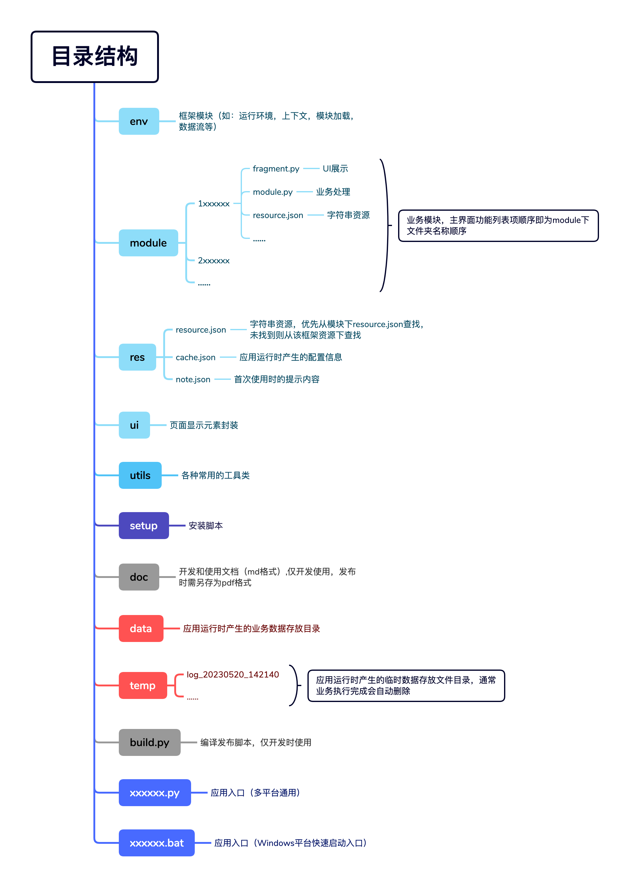
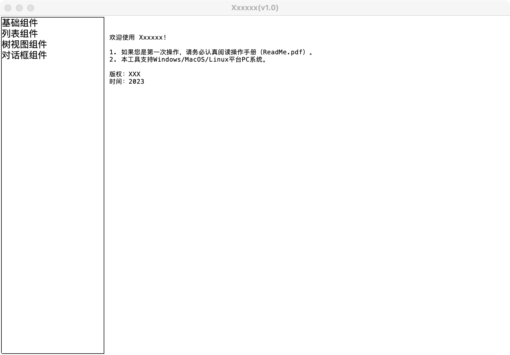
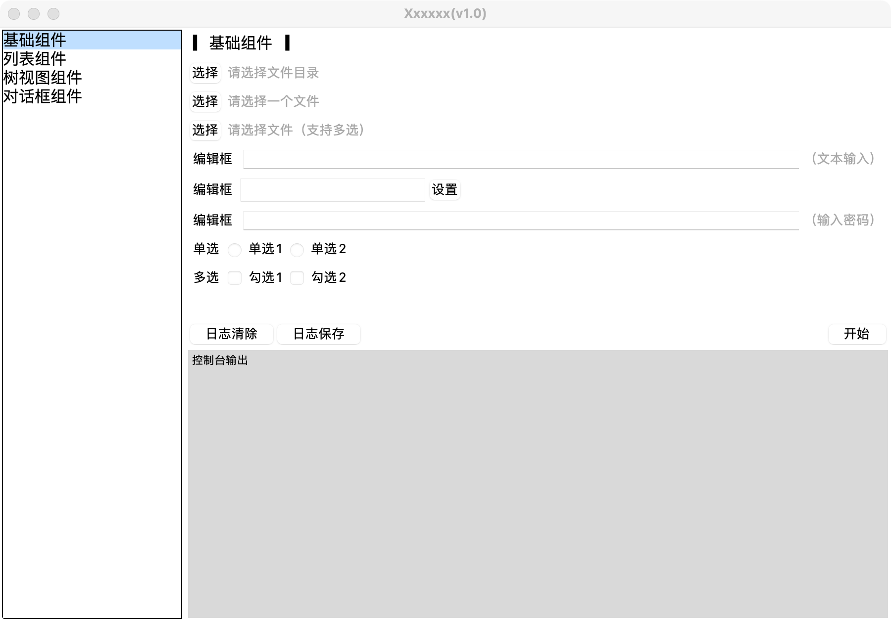
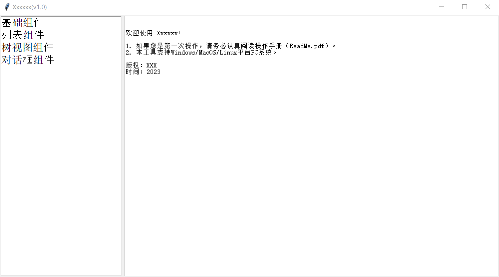
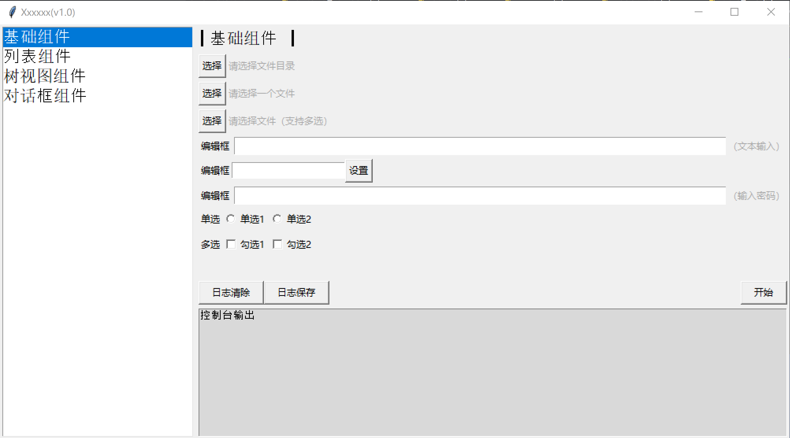

# 开发手册

### 说明

### 环境

##### 1）系统

本工程支持在`Windows`、`Linux(Ubuntu/UOS)`、`MacOS`系统下运行。

##### 2）python

本工程支持`Python`的`2.x`和`3.x`运行环境，`2.x`版本仅支持官方发布的最后一个版本`2.7.18`。

>   官方下载：https://www.python.org/downloads/release/python-2718/
>

### 代码目录结构

### 各平台效果

##### MacOS

##### Windows

##### Linux（Ubuntu）

